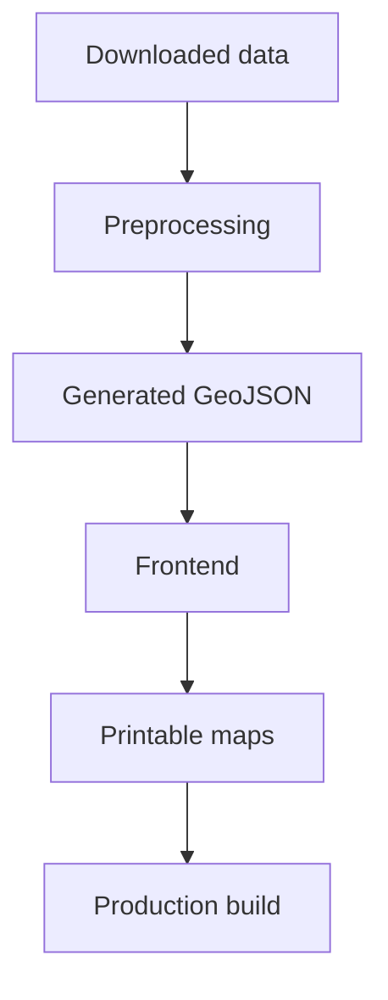
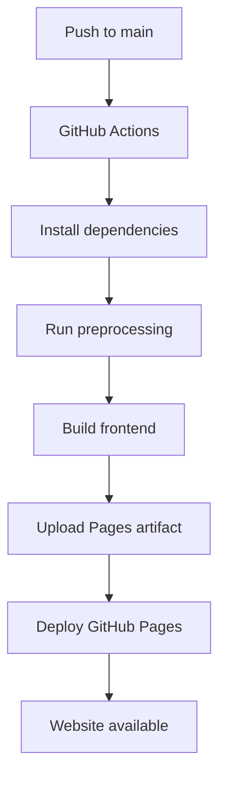

# hide_and_seek

Static Copenhagen hide-and-seek map toolkit. The repository combines Python preprocessing, a Vite-based multi-page frontend, and an A3 printable map export.

## Project overview

The project provides a Copenhagen-only map and lookup app for a hide-and-seek ruleset. It is intentionally static at runtime: the Python pipeline downloads and filters source datasets, writes compact GeoJSON into the web app, and the frontend reads those files directly.

High-level architecture:

1. Python preprocessing downloads and clips source data to the Copenhagen play area.
2. Vite builds the interactive pages and copies generated data into the production bundle.
3. A Node script renders the printable map to PDF from the built print page.
4. GitHub Actions deploys the built site to GitHub Pages.

Technology stack:

- Python 3.12 with `uv`, `requests`, `shapely`, and `pyproj` for preprocessing
- Node.js 20 with `Vite`, `Leaflet`, `Playwright`, and `qrcode`
- GitHub Actions and GitHub Pages for hosting

## Quick Start

### 1. Clone the repository

```bash
git clone https://github.com/<owner>/hide_and_seek.git
cd hide_and_seek
```

### 2. Install prerequisites

Install Python 3.12+, Node.js 20+, npm, and `uv`.

### 3. Install dependencies

```bash
uv sync
npm ci
```

### 4. Rebuild datasets

```bash
npm run build:data
```

This downloads source data when needed and rewrites the generated GeoJSON in `web/public/data/`.

### 5. Start the development server

```bash
npm run dev
```

Open the local URL printed by Vite.

### 6. Build for production

```bash
npm run build
```

This builds the frontend into `dist/` and writes `dist/print-map.pdf`.

### 7. Preview the production build

```bash
npm run preview
```

Open the local URL printed by Vite preview.

## Repository structure

- `scripts/`: preprocessing, build, PDF, and capture scripts
- `data/`: downloaded raw source data cached by preprocessing
- `docs/`: short source notes and documentation index
- `src/hide_and_seek/`: currently empty reserved Python package directory
- `tests/`: Python tests for preprocessing and supporting logic
- `web/`: the frontend source, HTML entry points, and Vite configuration
- `web/src/`: reusable browser modules for maps, lookups, overlays, and page setup
- `web/public/`: static assets copied by Vite into the production build
- `web/public/data/`: generated runtime GeoJSON consumed by the frontend
- `web-tests/`: Playwright end-to-end tests
- `dist/`: production build output created by Vite and the PDF script

## Data pipeline

The preprocessing pipeline lives in `scripts/build_data.py`.

Downloaded data:

- Rejseplanen GTFS ZIP from `https://www.rejseplanen.info/labs/GTFS.zip`
- Dataforsyningen GeoJSON for kommuner, postnumre, opstillingskredse, and sogne

Processing flow:

1. Read the committed Copenhagen boundary from `web/public/data/boundary.geojson`.
2. Download raw source files into `data/raw/` when they are missing.
3. Clip every administrative layer to the Copenhagen boundary.
4. Simplify geometries so the browser only receives the playable area.
5. Group postal areas by name and merge their clipped geometries.
6. Extract Metro and S-tog routes and stations from GTFS.
7. Normalize station names and retain only the Copenhagen transport network used by the game.

Why only Copenhagen data is retained:

The app is designed around the Copenhagen play area. Clipping everything to the committed boundary keeps the runtime payload small and avoids shipping nationwide data to the browser.

Generated GeoJSON output:

- `web/public/data/municipalities.geojson`
- `web/public/data/postnumre.geojson`
- `web/public/data/opstillingskredse.geojson`
- `web/public/data/sogne.geojson`
- `web/public/data/boundary.geojson`
- `web/public/data/transport-lines.geojson`
- `web/public/data/transport-stations.geojson`

Frontend inputs:

- Administrative overlays read the four administrative GeoJSON files plus the boundary file.
- The main map, guide page, and transport layers read `transport-lines.geojson` and `transport-stations.geojson`.
- Vite serves these files from `/data/*.geojson` in development and copies them into `dist/` for production.



## Frontend architecture

The frontend is a multi-page Leaflet app built from `web/index.html`, `web/print.html`, `web/where-am-i.html`, and `web/guide.html`.

Map architecture:

- `web/src/main.js` initializes the main interactive map.
- `web/src/shared.js` provides shared map and data loading helpers.
- `web/src/AdministrativeLayer.js` and `web/src/LabelManager.js` handle overlays and zoom-sensitive labels.
- `web/src/transport.js` renders Metro and S-tog lines and stations.

Data loading:

- Administrative layers are fetched as generated GeoJSON from `/data/`.
- Transport layers are fetched from the generated line and station files and filtered by network in the browser.
- The boundary file is used to fit the initial map view to the playable area.

Reusable modules:

- `web/src/AdministrativeLookup.js`, `web/src/PolygonLookup.js`, and `web/src/LocationLookup.js` power the "Where am I?" page.
- `web/src/AddressLookup.js` adds address search and coordinate resolution.
- `web/src/GuidePage.js` builds the station guide and transfer summaries.
- `web/src/print.js` and `web/src/WhereAmIPage.js` provide page-specific startup logic.

Overlays and station data:

- Administrative overlays cover kommuner, postnumre, opstillingskredse, and sogne.
- Transport stations are normalized in preprocessing and reused by the map and guide pages.
- Metro and S-tog lines are kept as separate networks so the UI can render them with network-specific styling.

Print pages:

- `web/print.html` renders the printable map layout.
- `scripts/build_print_pdf.mjs` opens the built print page and writes `dist/print-map.pdf`.

## Development

Rebuild datasets:

```bash
npm run build:data
```

Regenerate printable maps:

```bash
npm run build:site && npm run build:pdf
```

Run tests:

```bash
uv run pytest
npm test
```

If Playwright browsers are missing:

```bash
npx playwright install --with-deps chromium
```

Linting:

- No dedicated lint command is currently defined in `package.json`.

Verify a production build locally:

```bash
npm run build
npm run preview
```

## Deploying to GitHub Pages

### Prerequisites

- GitHub repository
- GitHub Actions enabled
- GitHub Pages enabled

### Repository settings

Set the repository to publish from GitHub Actions:

1. Open the repository on GitHub.
2. Go to Settings.
3. Open Pages.
4. Under Build and deployment, set Source to GitHub Actions.

No branch or folder source should be selected when GitHub Actions is used.

### Deployment workflow

The deployment workflow is `.github/workflows/deploy-pages.yml`.

Trigger:

- push to `main` or `master`
- manual run through `workflow_dispatch`

Deployment flow:



What the workflow does:

1. Checks out the repository.
2. Installs Python 3.12 and `uv`.
3. Installs Node.js 20.
4. Runs `uv sync` to install Python dependencies.
5. Runs `npm ci` to install Node dependencies.
6. Installs Playwright Chromium.
7. Runs `npm run build`.
8. Uploads `dist/` as the Pages artifact.
9. Deploys the artifact with `actions/deploy-pages`.

### Build commands

Local build script used by deployment:

```bash
npm run build
```

That command expands to:

```bash
npm run build:site && npm run build:pdf
```

The workflow itself also runs:

```bash
uv sync
npm ci
npx playwright install --with-deps chromium
```

### Publishing a new version

1. Commit the changes.
2. Push to `main`.
3. Wait for the GitHub Actions workflow to finish.
4. Verify that the Pages deploy job succeeded.
5. Open the GitHub Pages URL.

No manual upload step is required.

### Deployment files

- `.github/workflows/deploy-pages.yml`: defines the GitHub Pages build and deploy pipeline.
- `package.json`: defines the Node scripts used locally and in CI.
- `package-lock.json`: pins the Node dependency tree used by `npm ci`.
- `pyproject.toml`: defines the Python project metadata and runtime dependencies.
- `uv.lock`: pins the Python environment used by `uv sync`.
- `scripts/build_data.py`: downloads, filters, and writes generated GeoJSON.
- `scripts/build_print_pdf.mjs`: generates `dist/print-map.pdf` from the built print page.
- `web/vite.config.js`: configures the multi-page Vite build and output directory.
- `playwright.config.js`: configures browser-based verification against the production preview server.

## Documentation notes

Dataset-specific source notes live in `docs/datasets/`. Update the relevant note whenever a source changes, and keep this README aligned with the scripts and build pipeline.
2. Open the published Pages URL shown in the deploy job environment output.
3. Verify index, print, guide, and where-am-i pages load.

### Published site URL pattern

For repo owner/repo:
- https://owner.github.io/repo/

## Troubleshooting

### App loads but data is missing

- Verify web/public/data contains expected GeoJSON/JSON files.
- Re-run npm run build:data and both transit extraction scripts.

### Browser tests fail immediately

- Install Playwright browser binaries:
  npx playwright install --with-deps chromium

### Python imports fail in tests

- Re-run uv sync to restore environment.
- Confirm tests use uv run pytest.

## Adding New Datasets

Recommended process:
1. Add a downloader/loader step in scripts/build_data.py.
2. Filter to the playable boundary during preprocessing.
3. Simplify geometry before writing output.
4. Write output to web/public/data.
5. Add a dedicated loader in web/src only if the dataset is needed at runtime.
6. Add or update tests and docs.

Keep nationwide data out of runtime payloads unless clipped and needed inside the playable area.
