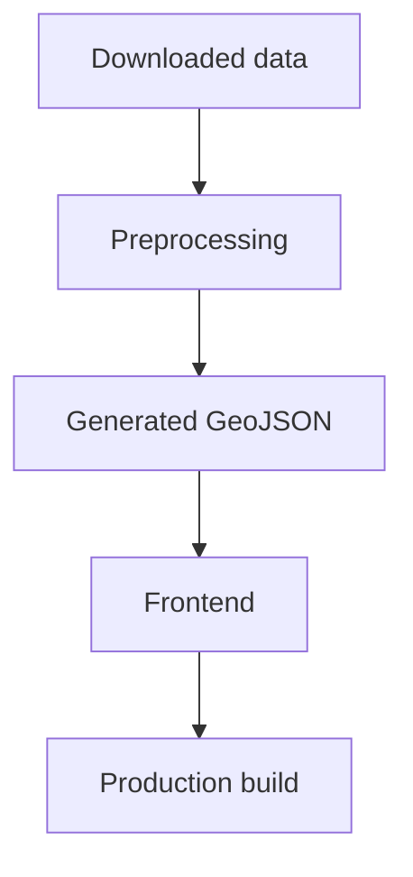
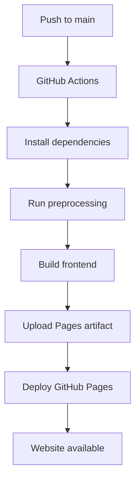

# hide_and_seek

Static Copenhagen hide-and-seek map toolkit. The repository combines Python preprocessing and a Vite-based multi-page frontend.

## Project overview

The project provides a Copenhagen-only map and lookup app for a hide-and-seek ruleset. It is intentionally static at runtime: the Python pipeline downloads and filters source datasets, writes compact GeoJSON into the web app, and the frontend reads those files directly.

High-level architecture:

1. Python preprocessing downloads and clips source data to the Copenhagen play area.
2. Vite builds the interactive pages and copies generated data into the production bundle.
3. GitHub Actions deploys the built site to GitHub Pages.

Technology stack:

- Python 3.12 with `requests` and `shapely` for preprocessing
- Node.js 20 with `Vite`, `Leaflet`, and `Playwright`
- GitHub Actions and GitHub Pages for hosting

## Quick Start

### 1. Clone the repository

```bash
git clone https://github.com/<owner>/hide_and_seek.git
cd hide_and_seek
```

### 2. Install prerequisites

Install Python 3.12+, Node.js 20+, npm, and `uv` (or `pip`).

### 3. Install dependencies

```bash
npm ci
```

### 4. Rebuild datasets

```bash
npm run build:data
```

This downloads source data when needed and rewrites the generated GeoJSON in `web/public/data/`.

### 5. Start the development server

```bash
npm run dev
```

Open the local URL printed by Vite.

### 6. Build for production

```bash
npm run build
```

This builds the static frontend into `dist/`.

### 7. Preview the production build

```bash
npm run preview
```

Open the local URL printed by Vite preview.

## Repository structure

- `scripts/`: preprocessing orchestration, focused data modules, and PDF generators
- `data/`: downloaded raw source data cached by preprocessing
- `docs/`: short source notes and documentation index
- `web/`: the frontend source, HTML entry points, and Vite configuration
- `web/src/`: reusable browser modules grouped into map, lookup, config, and UI folders
- `web/public/`: static assets copied by Vite into the production build
- `web/public/data/`: generated runtime GeoJSON consumed by the frontend
- `web-tests/`: Playwright end-to-end tests
- `dist/`: production build output created by Vite

## Data pipeline

The preprocessing entry point is `python -m scripts.build_data`. Its implementation is split by domain:

- `scripts/config/`: source URLs, paths, transit configuration, and shared theme metadata
- `scripts/io/`: downloads, JSON output, and GTFS archive I/O
- `scripts/geography/`: boundary, Movia zones, and administrative datasets
- `scripts/transit/`: GTFS service filtering, route selection, stop filtering, and route geometry
- `scripts/pdf/`: guide and transit-map PDF entry points

`build_data.py` keeps the command-line orchestration and compatibility exports used by the tests.

Downloaded data:

- Rejseplanen GTFS ZIP from `https://www.rejseplanen.info/labs/GTFS.zip`
- Dataforsyningen GeoJSON for kommuner, postnumre, opstillingskredse, and sogne

Processing flow:

1. Read the committed Copenhagen boundary from `web/public/data/boundary.geojson`.
2. Download raw source files into `data/raw/` when they are missing.
3. Clip every administrative layer to the Copenhagen boundary.
4. Simplify geometries so the browser only receives the playable area.
5. Group postal areas by name and merge their clipped geometries.
6. Extract Metro and S-tog routes and stations from GTFS.
7. Normalize station names and retain only the Copenhagen transport network used by the game.

Why only Copenhagen data is retained:

The app is designed around the Copenhagen play area. Clipping everything to the committed boundary keeps the runtime payload small and avoids shipping nationwide data to the browser.

Generated GeoJSON output:

- `web/public/data/municipalities.geojson`
- `web/public/data/postnumre.geojson`
- `web/public/data/opstillingskredse.geojson`
- `web/public/data/sogne.geojson`
- `web/public/data/boundary.geojson`
- `web/public/data/transport-lines.geojson`
- `web/public/data/transport-stations.geojson`

Frontend inputs:

- Administrative overlays read the four administrative GeoJSON files plus the boundary file.
- The main map and transport layers read `transport-lines.geojson` and `transport-stations.geojson`.
- Vite serves these files from `/data/*.geojson` in development and copies them into `dist/` for production.



## Frontend architecture

The frontend is a multi-page Leaflet app built from `web/index.html` and `web/where-am-i.html`.

Map architecture:

- `web/src/map/` contains the map entry point, Leaflet helpers, administrative layers, transport rendering, and map CSS.

Data loading:

- Administrative layers are fetched as generated GeoJSON from `/data/`.
- Transport layers are fetched from the generated line and station files and filtered by network in the browser.
- The boundary file is used to fit the initial map view to the playable area.

Reusable browser modules:

- `web/src/lookup/admin/` contains geometry and administrative lookup logic.
- `web/src/lookup/address/` handles Dataforsyningen address search and browser location access.
- `web/src/lookup/page/` contains the "Where Am I?" page and its CSS.
- `web/src/lookup/LookupService.js` remains a compatibility export for the focused lookup modules.
- `web/src/ui/` provides shared CSS and accessible tab behavior.

Stylesheet ownership:

- `web/src/ui/style.css` contains shared page foundations, links, and tab controls.
- `web/src/map/map.css` and `web/src/lookup/page/where-am-i.css` contain page-specific styles.

The "Where am I?" page becomes interactive without downloading administrative polygons. It loads and indexes those files only after geolocation succeeds or an address is selected. Address autocomplete requests are cancellable so an older response cannot replace newer suggestions.

Overlays and station data:

- Administrative overlays cover kommuner, postnumre, opstillingskredse, and sogne.
- Transport stations are normalized in preprocessing and reused by the map.
- Metro and S-tog lines are kept as separate networks so the UI can render them with network-specific styling.

## Development

Rebuild datasets:

```bash
npm run build:data
```

Run tests:

```bash
npm test
```

If Playwright browsers are missing:

```bash
npx playwright install chromium-headless-shell
```

Verify a production build locally:

```bash
npm run build
npm run preview
```

## Deploying to GitHub Pages

### Prerequisites

- GitHub repository
- GitHub Actions enabled
- GitHub Pages enabled

### Repository settings

Set the repository to publish from GitHub Actions:

1. Open the repository on GitHub.
2. Go to Settings.
3. Open Pages.
4. Under Build and deployment, set Source to GitHub Actions.

No branch or folder source should be selected when GitHub Actions is used.

### Deployment workflow

The deployment workflow is `.github/workflows/deploy-pages.yml`.

Trigger:

- push to `main` or `master`
- manual run through `workflow_dispatch`

Deployment flow:



What the workflow does:

1. Checks out the repository.
2. Installs Python 3.12 and `uv`.
3. Installs Node.js 20.
4. Runs `npm ci` to install Node dependencies.
5. Runs `npm run build`.
6. Uploads `dist/` as the Pages artifact.
7. Deploys the artifact with `actions/deploy-pages`.

### Build commands

Local build script used by deployment:

```bash
npm run build
```

### Publishing a new version

1. Commit the changes.
2. Push to `main`.
3. Wait for the GitHub Actions workflow to finish.
4. Verify that the Pages deploy job succeeded.
5. Open the published Pages URL.

No manual upload step is required.

### Deployment files

- `.github/workflows/deploy-pages.yml`: defines the GitHub Pages build and deploy pipeline.
- `package.json`: defines the Node scripts used locally and in CI.
- `package-lock.json`: pins the Node dependency tree used by `npm ci`.
- `pyproject.toml`: defines the Python project metadata and runtime dependencies.
- `scripts/build_data.py`: orchestrates downloads, filtering, and generated GeoJSON output.
- `web/vite.config.js`: configures the multi-page Vite build and output directory.
- `playwright.config.js`: configures browser-based verification against the production preview server.

### Published site URL pattern

For repo owner/repo:
- https://owner.github.io/repo/

## Troubleshooting

### App loads but data is missing

- Verify `web/public/data/` contains expected GeoJSON files.
- Re-run `npm run build:data`.

### Browser tests fail immediately

- Install Playwright browser binaries:
  `npx playwright install chromium`

